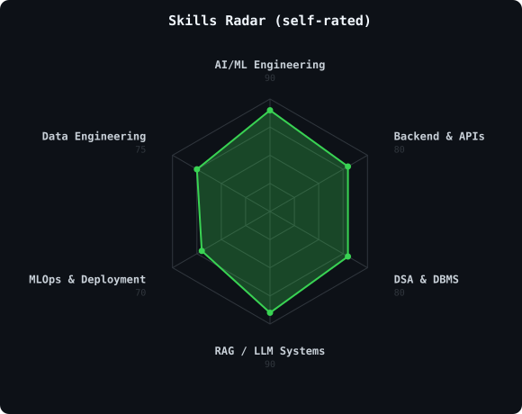
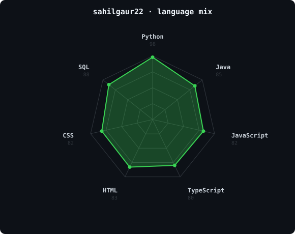

<!-- PORTRAIT - generated by scripts/dotify.py from assets/portrait-source.png.
     Regenerate with:
       python scripts/dotify.py assets/portrait-source.png -o assets/portrait-dark \
         --cols 110 --cell-px 6 --detail 1.0 --bg-color "#0d1117"
       python scripts/dotify.py assets/portrait-source.png -o assets/portrait-light \
         --cols 110 --cell-px 6 --detail 1.0 --bg-color "#ffffff" --stroke "rgba(0,0,0,0.3)" -->
<picture>
  <source media="(prefers-color-scheme: dark)"  srcset="assets/portrait-dark.svg">
  <source media="(prefers-color-scheme: light)" srcset="assets/portrait-light.svg">
  
</picture>

 

<!-- NAME / TAGLINE - animated typing -->

 

<!-- SOCIALS -->

---

## About Me

Hi, I'm **Sahil Gaur**. I build things at the intersection of AI engineering and backend systems —
agentic workflows, RAG pipelines, and the low-latency APIs that serve them.

- I spend an unreasonable amount of free time on **DSA** — LeetCode problems are basically my version of a crossword puzzle
- My code has a strange habit of working perfectly at 2 AM and mysteriously breaking the moment I try to demo it
- Currently building **VoxLoom** (automated meeting assistant) and **EduRAG** (AI teaching assistant)
- BTech in AI & ML @ Guru Gobind Singh Indraprastha University (2023–2027)
- Fun fact: **I like optimizing for token efficiency and inference latency almost as much as for correctness.**

 

## Toolbox

---

## Skills Radar

<table>
<tr>
<td width="50%" align="center" valign="middle">

<!-- Self-rated radar -->
<!-- Generated by scripts/language_radar.py's renderer, edit the `data` list in that call to change ratings -->
<picture>
  <source media="(prefers-color-scheme: dark)"  srcset="assets/radar-skills-dark.svg">
  <source media="(prefers-color-scheme: light)" srcset="assets/radar-skills-light.svg">
  
</picture>

</td>
<td width="50%" align="center" valign="middle">

<!-- Live radar built from real language byte counts across your repos -->
<!-- Generated by scripts/language_radar.py, refreshed by .github/workflows/language-radar.yml -->
<picture>
  <source media="(prefers-color-scheme: dark)"  srcset="assets/radar-langs-dark.svg">
  <source media="(prefers-color-scheme: light)" srcset="assets/radar-langs-light.svg">
  
</picture>

</td>
</tr>
</table>

---
